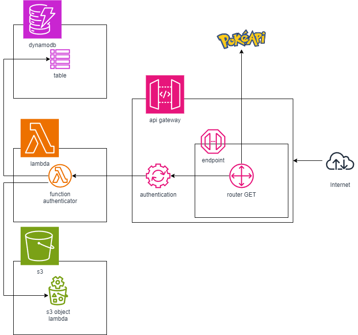

# aws_apigateway_authenticator

Utilizando o serviço **Api Gateway AWS**, foi implementado um autenticador de uma aplicação web (utilizado PokeAPI como serviço rest);

# Caracteristicas:

- Implementação de um autenticador, sem necessidade de auteração, ou acesso ao código do serviço exposto;
- Contabilização de acessos (observability metrics) via **DynamoDB** por facilidade de deploy de serviço, podendo ser substituido por qualquer outro serviço de metricas como Prometheus;
- Deploy de autenticador feito via terraform, para dispor todas as configurações necessarias como default;

# Arquitetura

